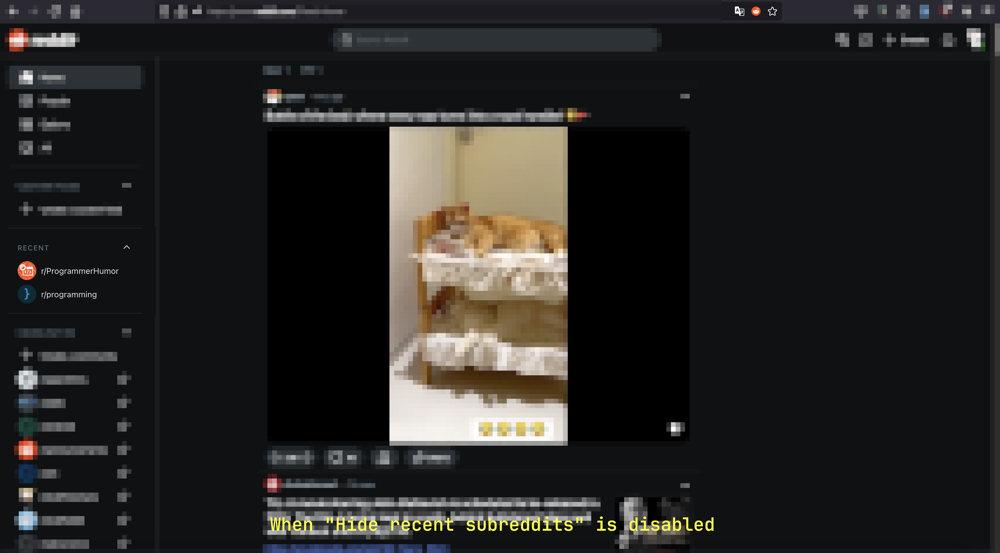
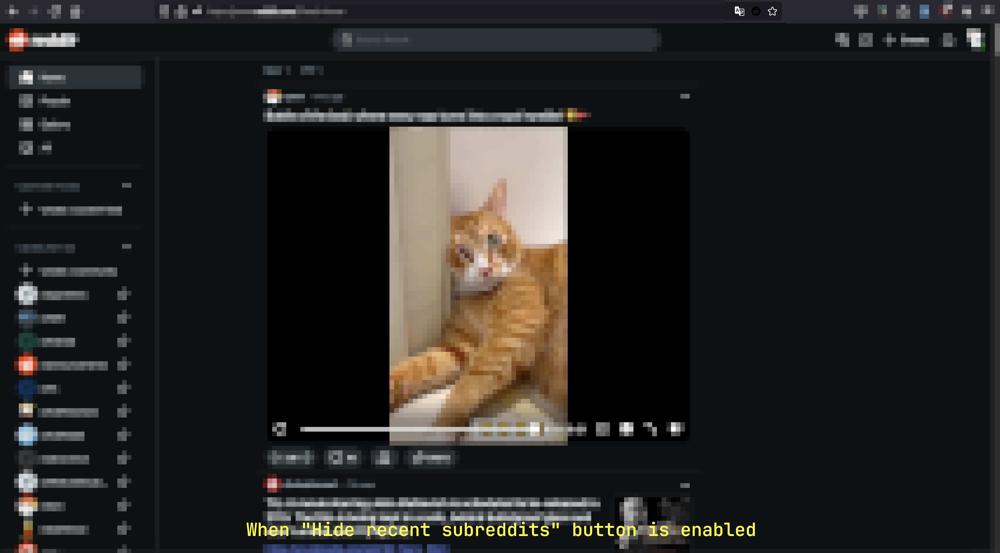

<!-- PROJECT LOGO -->
 

  

<h3 align="center">Plugin - Hide recent subreddits</h3>

  

    Hide the 'Recent Subreddits' section to avoid potential embarrassment in case you accidentally visit any NSFW subreddits!
  

<!-- ABOUT THE PROJECT -->
## About The Project

When you visit a subreddit, a “Recent” section is added to the left sidebar, displaying all your recently visited subreddits. While this feature can be convenient, it might be less desirable if you’ve visited NSFW subreddits. Unfortunately, I couldn’t find an option to remove this section through the site’s settings. Instead, I had to go into the site’s local storage and delete the key “recent-subreddits-store.” It’s not a huge hassle, but I prefer not having any history on my homepage.

With this simple plugin, you can easily toggle the visibility of your recent subreddits. Once installed, a Reddit icon will appear in your browser’s URL bar. Clicking this icon allows you to switch between hiding and viewing the “Recent” section. By default, the section will be hidden.

(<a href="#readme-top">back to top</a>)

### Built With

* [Browser extensions - Mozilla | MDN](Firefox-extensions-url)

(<a href="#readme-top">back to top</a>)

<!-- USAGE EXAMPLES -->
## Usage

Go to [Firefox addons store](https://addons.mozilla.org/en-US/firefox/addon/hide-recent-subreddits-store/) and click the "Add to Firefox" button.

(<a href="#readme-top">back to top</a>)

<!-- ROADMAP -->
## Roadmap

- [ ] Develop it as a cross-browser extension

(<a href="#readme-top">back to top</a>)

<!-- Set up development environment -->
## Set up development environment

To test the plugin, you have two options:

1.	In the Firefox URL bar, type about:debugging, click on “This Firefox,” then select “Load Temporary Add-on…” and choose any file from the plugin directory.
2.	Use the web-ext command-line tool, which opens a separate Firefox window for testing. It automatically reloads when file changes occur and can also be used for building and publishing the plugin.

Learn more about these approaches in [about:debugging](https://developer.mozilla.org/en-US/docs/Mozilla/Add-ons/WebExtensions/Your_first_WebExtension#installing) and [web-ext](https://extensionworkshop.com/documentation/develop/getting-started-with-web-ext/).

(<a href="#readme-top">back to top</a>)

<!-- LICENSE -->
## License

Distributed under the MIT License. See `LICENSE.txt` for more information.

(<a href="#readme-top">back to top</a>)

<!-- CONTACT -->
## Contact

Kamrul H. Shourov - shourov.kamrul@gmail.com

Project Link: [https://github.com/github_username/repo_name](https://github.com/khshourov/plugin-hide-recent-subreddits)

(<a href="#readme-top">back to top</a>)

<!-- ACKNOWLEDGMENTS -->
## Acknowledgments

* [Reddit icons created by Freepik - Flaticon](https://www.flaticon.com/free-icons/reddit)

(<a href="#readme-top">back to top</a>)

<!-- MARKDOWN LINKS & IMAGES -->
<!-- https://www.markdownguide.org/basic-syntax/#reference-style-links -->
[product-screenshot]: images/screenshot.png
[Firefox-extensions-url]: https://developer.mozilla.org/en-US/docs/Mozilla/Add-ons/WebExtensions
